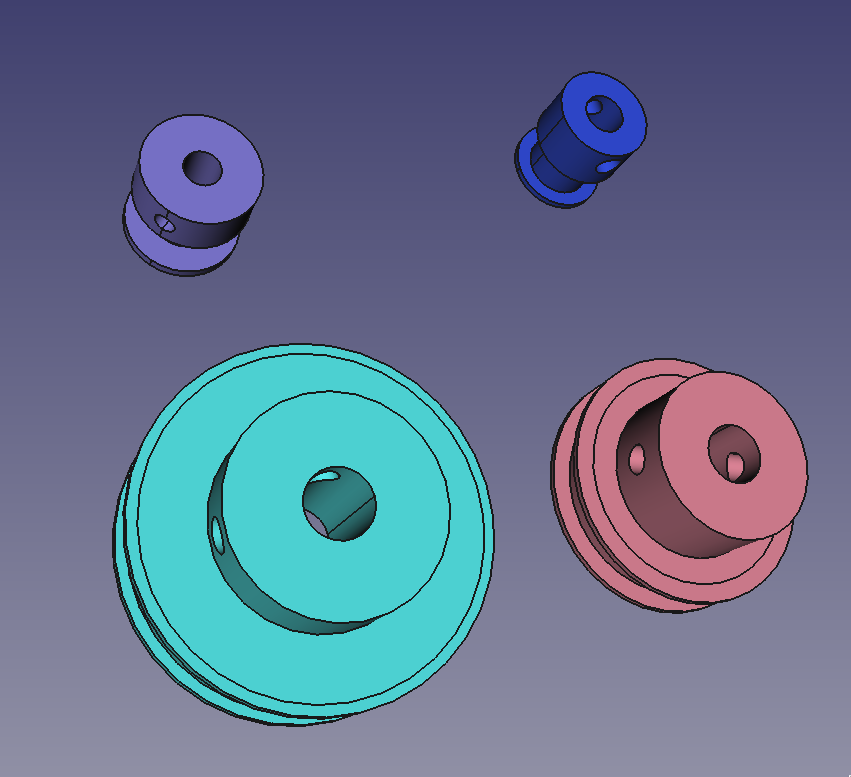
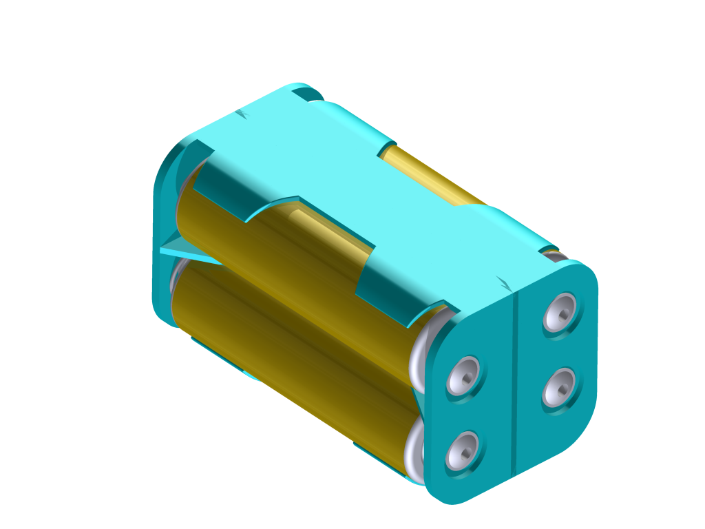
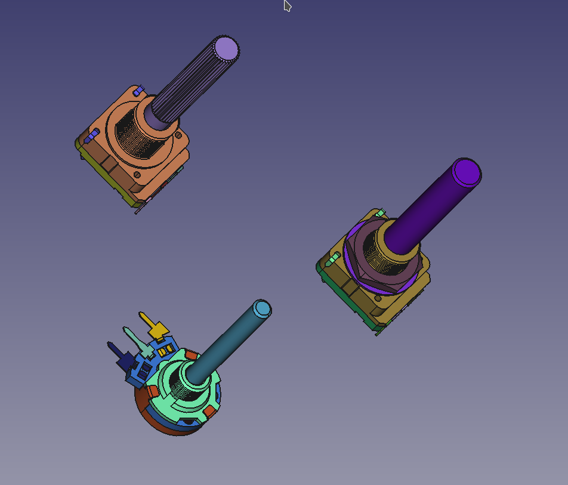

## Mi Librería  de freecad

### Diseño propio

Archivos en freecad diseñados por mi. Todos los archivos son distribuidos 
bajo licencia Creative Common Share a Like Not comercial use.

#### Poles GT2

Polaes GT2 de tamaños diferentes: 16,20,48, y 60 dientes.

### Recopilados por la red

Archivos recopilados por la red para usar en mis diseños de freecad-

#### Portapilas 4 Pilas AA.

Fuente: https://grabcad.com/library/battery-pack-2

#### Potenciometro:

https://grabcad.com/library/control-potentiometers-1

