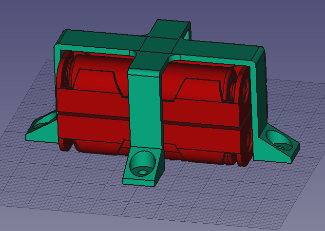

# Soporte para portapilas 4AA

## Soporte portapilas

Soporte para el portapilas cuadrado de 4 pilas del tipo AA.

Este soporte está pensado, bien para atornillar con tornillos de métrica 3, o bien para sujetar con chinchetas sobre un corcho.

## Variante soporte portapilas

Este soporte es una variante del anterior. Está pensado para sujetar el portapilas con un par de gomas elásticas.
